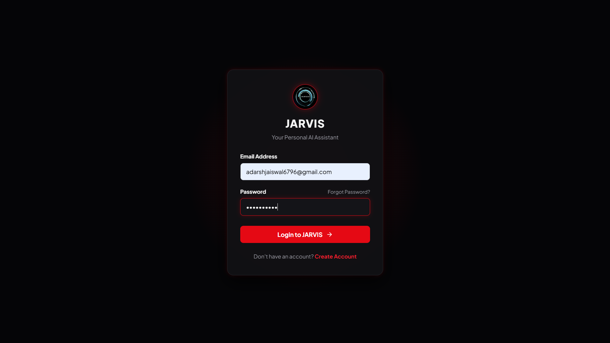
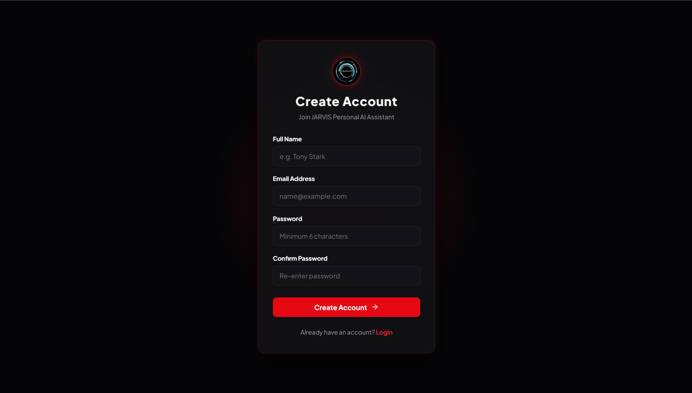
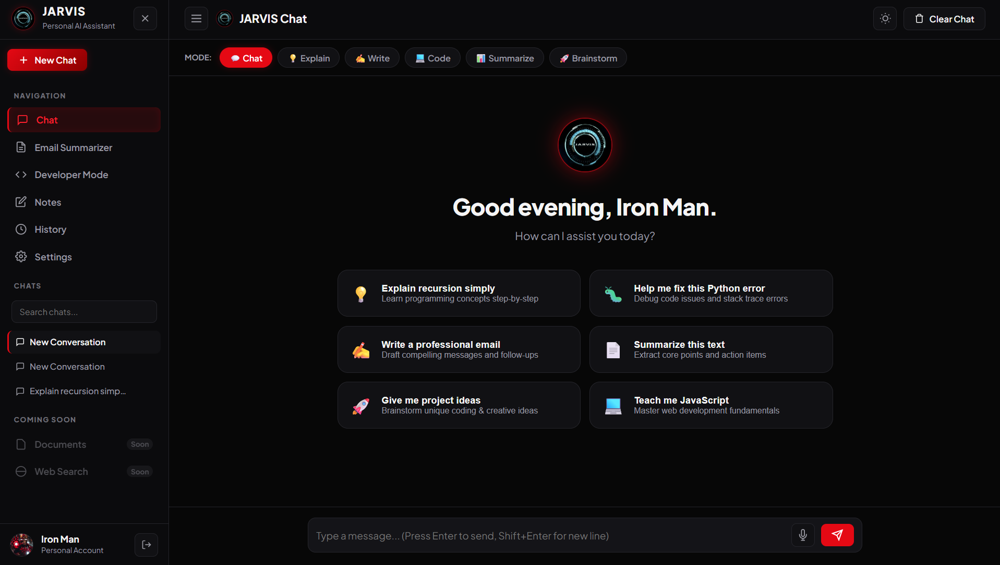
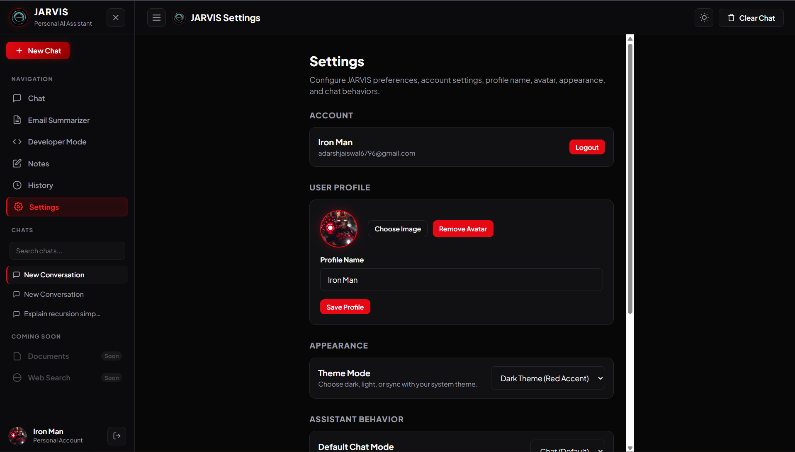
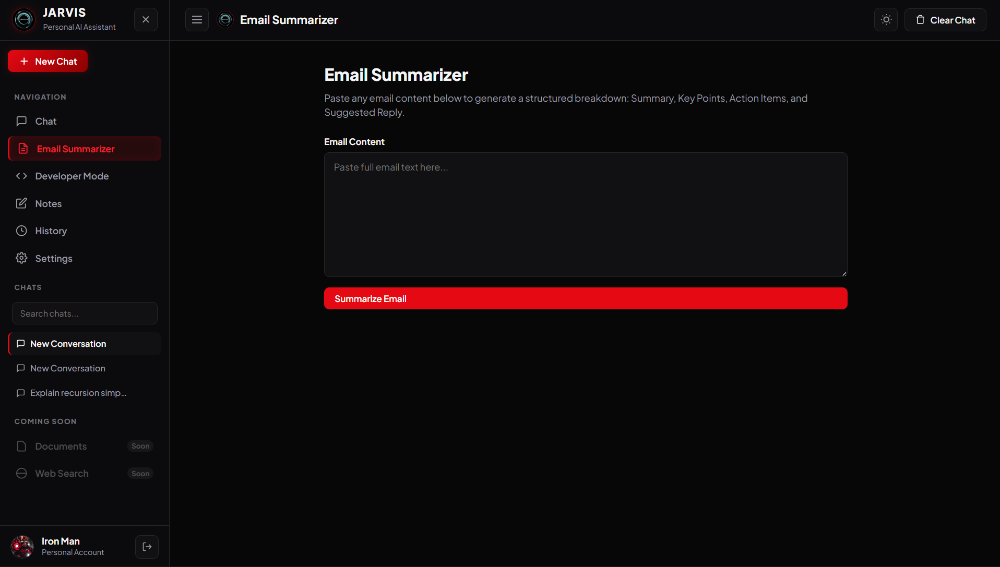
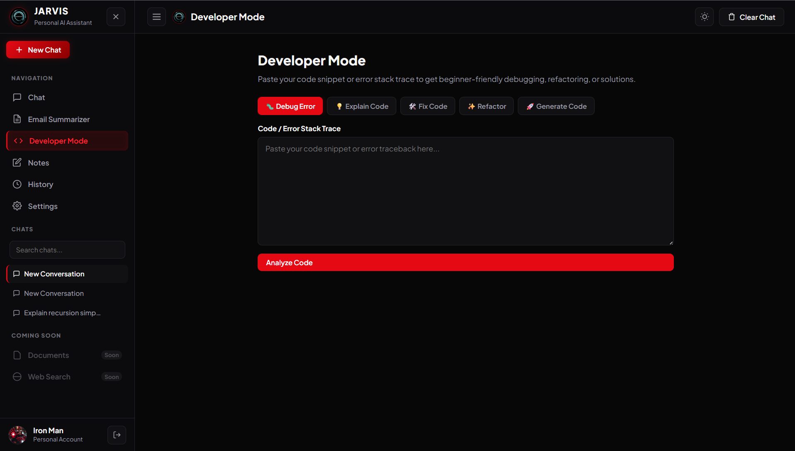
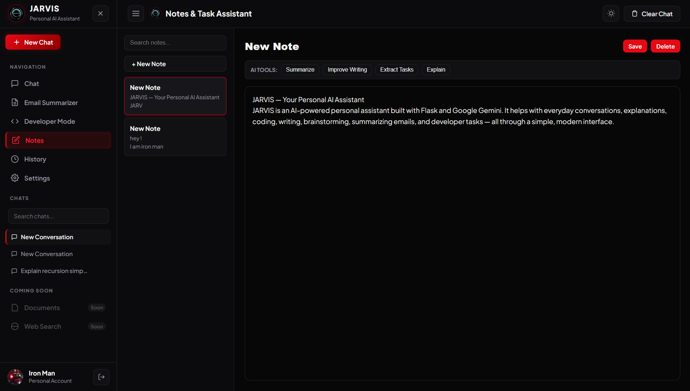

# 🤖 JARVIS — Your Personal AI Assistant

> A smart, modern, and powerful personal AI assistant powered by Google Gemini.

JARVIS is a personal AI assistant built with **Flask** and **Google Gemini**. It provides a modern conversational interface with multiple AI modes and productivity tools designed to help with everyday questions, coding, writing, brainstorming, email summarization, and more.

---

## ✨ Features

### 💬 AI Chat

Have natural conversations with JARVIS using Google Gemini.

### 🧠 Multiple AI Modes

Choose the mode that best fits your task:

- 💬 **Chat** — General conversations and questions
- 💡 **Explain** — Understand complex topics simply
- ✍️ **Write** — Generate and improve written content
- 💻 **Code** — Coding assistance and programming help
- 📊 **Summarize** — Summarize long content
- 🚀 **Brainstorm** — Generate creative ideas

### ➕ Multiple Conversations

- Create new conversations
- Automatically save chats
- Switch between previous conversations
- Search conversations
- Rename conversations
- Delete conversations
- Clear the current conversation

### 📧 Email Summarizer

Paste an email and JARVIS generates a structured breakdown including:

- Summary
- Key Points
- Action Items
- Important Dates
- Suggested Reply

### 👨‍💻 Developer Mode

A dedicated coding assistant for:

- Debugging errors
- Explaining code
- Fixing code
- Refactoring
- Generating code

### 📝 Notes & Task Assistant

Create and manage notes with AI-powered tools such as:

- Summarize
- Improve Writing
- Extract Tasks
- Explain

### 🔐 Authentication

Secure user authentication using:

- Flask Sessions
- SQLite
- Werkzeug password hashing
- Login & Signup
- Logout
- User profile

### 👤 User Profile

Customize your JARVIS profile with:

- Profile name
- Profile avatar
- Account information

### 🎙️ Voice Input

Use your microphone to interact with JARVIS using voice input.

### 🎨 Premium UI

Modern dark interface featuring:

- Red & Black JARVIS theme
- Responsive design
- Subtle red glow effects
- Modern AI dashboard
- Mobile-friendly layout

### 🌓 Theme Support

Choose between available theme modes from Settings.

---

## 📸 Screenshots

### 🔐 Authentication

#### Login

#### Create Account

---

### 🤖 JARVIS Chat

---

### ⚙️ Settings

---

### 📧 Email Summarizer

---

### 👨‍💻 Developer Mode

---

### 📝 Notes & Task Assistant

---

## 🛠️ Tech Stack

### Backend

- Python
- Flask
- Google Gemini API
- SQLite
- Werkzeug

### Frontend

- HTML5
- CSS3
- JavaScript
- Web Speech API
- LocalStorage

### AI

- Google Gemini

---

## 📂 Project Structure

JARVIS-AI-Assistant/
│
├── static/
│   ├── css/
│   ├── js/
│   └── images/
│       └── jarvis_logo.jpg
│
├── templates/
│   ├── index.html
│   ├── login.html
│   └── signup.html
│
├── screenshots/
│   ├── login.png
│   ├── signup.png
│   ├── chat.png
│   ├── settings.png
│   ├── email-summarizer.png
│   ├── developer-mode.png
│   └── notes.png
│
├── main.py
├── requirements.txt
├── .env.example
├── .gitignore
└── README.md

---

## 🤖 How JARVIS Helps

JARVIS is designed to make everyday tasks easier, faster, and more organized with the help of AI.

- 💬 **Everyday Conversations** — Ask questions, get explanations, and have natural conversations.
- 🧠 **Learn & Understand** — Simplify difficult concepts and understand topics more clearly.
- ✍️ **Writing Assistance** — Write, rewrite, improve, and brainstorm ideas.
- 💻 **Developer Support** — Get help with coding, debugging, logic, and technical problems.
- 📧 **Email Summarization** — Quickly understand long emails with summaries, key points, action items, and suggested replies.
- 📝 **Notes & Tasks** — Create and manage personal notes and use AI assistance for organizing tasks.
- 🗣️ **Voice Input** — Interact with JARVIS using voice input through the browser.
- 🗂️ **Conversation History** — Keep multiple conversations organized and easily continue previous chats.
- 🎨 **Personalized Experience** — Customize your profile, appearance, and JARVIS behavior.

---

## 🎯 Project Goal

The goal of **JARVIS — Your Personal AI Assistant** is to build a practical, user-friendly AI assistant that combines conversational AI with useful everyday tools in a single application.

This project was created to explore and implement real-world concepts such as:

- Artificial Intelligence integration
- Google Gemini API
- Flask backend development
- User authentication and session management
- SQLite database integration
- Frontend and backend communication
- Persistent conversation management
- AI-powered productivity features
- Responsive and modern UI design

JARVIS is built as a learning-focused project with the goal of continuously improving its capabilities and becoming a more useful personal AI assistant.

---

## 👨‍💻 Author

**Adarsh Jayswal**

Computer Science Student | AI & Full-Stack Development Enthusiast

⭐ If you find this project interesting, consider giving it a star on GitHub!
